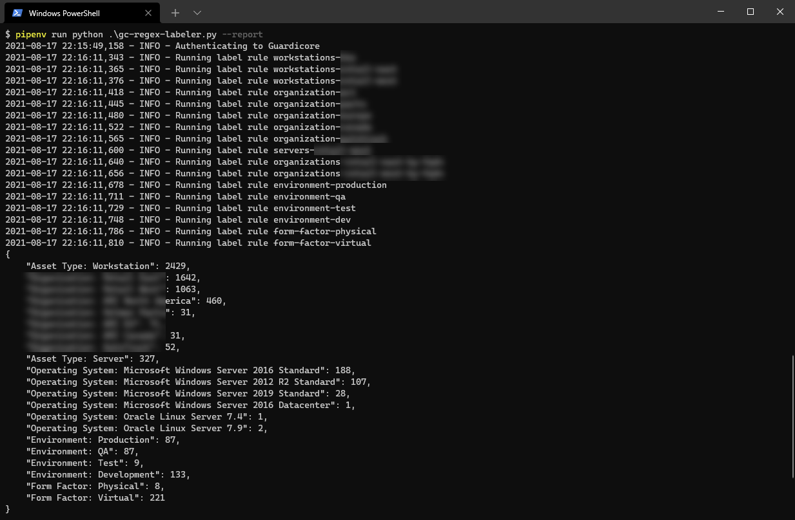

# Guardicore Regular Expression Labeler

Labels assets based on Regular expressions using the Centra API

## Future Features

- [x] Continuous labeling
- [x] Support for labeling based on values in lists (e.g. using the MAC address of a machine)
- [x] Multi-field criteria rules (must match expression across all fields to label)
- [x] Dockerized version for continuous labeling
- [ ] Hot reload of the config.yml file to load new rules without relaunching the container/script


## Usage

1. Clone the repository `git clone git@github.com:n3tsurge/gc-regex-labeler.git`
2. Install the dependencies `pip install`
3. Setup your labeling rules in `config.yml`
4. Run `pipenv run python gc-regex-labeler.py`

```text
$ pipenv run python .\gc-regex-labeler.py -h
usage: gc-regex-labeler.py [-h] [--config CONFIG]
                           [--gc-management-url GC_MANAGEMENT_URL] [--report]
                           [--rules] [--service]
                           [--wait-interval WAIT_INTERVAL]
                           [--verbose-log VERBOSE_LOG] [-u USER] [-p]

optional arguments:
  -h, --help            show this help message and exit
  --config CONFIG       The path to the configuration file
  --gc-management-url GC_MANAGEMENT_URL
                        Guardicore management URL
  --report              Report only mode, previews the labels that would be
                        created and the number of assets within
  --rules               Shows all the rules in the system and exists
  --service             Runs the Guardicore Regex Labeler in a loop with a
                        wait interval
  --wait-interval WAIT_INTERVAL
                        Wait interval between runs when running as a service
  --verbose-log VERBOSE_LOG
                        Turning this on will output verbose logs
  -u USER, --user USER  Guardicore username
  -p, --password        Prompt for the Guardicore password
```



## Labeling Rules

```yaml
domain-specific-workstations:
    enabled: false
    patterns:
      guest_agent_details.hostname: # The field to match expressions on
        - "^.*\\.example\\.com"
      guest_agent_details.os_details.os_display_name: "^.*Windows [^(Server)].*$"
    labels:
      Asset Type: Workstation
      Organization: Example
    source_field_labels:
      Operating System: guest_agent_details.os_details.os_display_name  # Set the label key with the value of this field if prior patterns match
```
